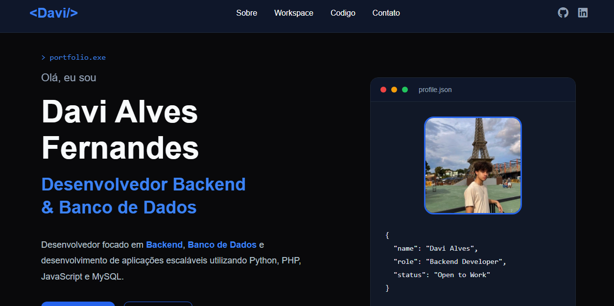

# 🚀 Portfólio - Davi Alves


Meu portfólio pessoal desenvolvido para apresentar minhas habilidades, projetos e experiências como desenvolvedor Backend e estudante de Banco de Dados.

O objetivo deste projeto foi criar uma aplicação moderna, responsiva e interativa, demonstrando conhecimentos em desenvolvimento Front-end e integração com Back-end através de um sistema funcional de envio de e-mails.

---

# 📸 Preview

<div align="center">



</div>


# ✨ Funcionalidades

- 🎨 Interface moderna inspirada em IDEs
- 💻 Explorador de código interativo
- ▶️ Execução de snippets JavaScript
- 🎉 Efeito Confetti
- ❄️ Efeito Snow
- 🔥 Efeito Fire
- 💻 Efeito Matrix
- ♻️ Reset dos efeitos
- 📧 Formulário de contato funcional
- 📩 Envio de e-mails utilizando Gmail SMTP
- 🔐 Configuração segura através de variáveis de ambiente (.env)
- 📱 Layout responsivo
- 🌊 Backgrounds animados
- ✨ Animações suaves
- 🎯 Código organizado por módulos

---

# 🛠 Tecnologias utilizadas

### Front-end

- HTML5
- CSS3
- JavaScript (ES6)

### Back-end

- PHP 8
- PHPMailer
- PHP Dotenv

### Ferramentas

- Composer
- Gmail SMTP
- Git
- GitHub

---

# 📂 Estrutura do projeto

```text
portfolio
│
├── assets
│   ├── css
│   ├── effects
│   ├── images
│   └── js
│
├── backend
│   └── send-email.php
│
├── vendor
│
├── .env.example
├── .gitignore
├── composer.json
├── composer.lock
├── index.html
└── README.md
```

---

# ⚙️ Como executar o projeto

## 1. Clone o repositório

```bash
git clone https://github.com/DaviDetroit/portfolio.git
```

---

## 2. Acesse a pasta

```bash
cd portfolio
```

---

## 3. Instale as dependências

```bash
composer install
```

---

## 4. Crie o arquivo `.env`

Utilize o arquivo `.env.example` como base.

Exemplo:

```env
MAIL_HOST=smtp.gmail.com
MAIL_PORT=587

MAIL_USERNAME=seuemail@gmail.com
MAIL_PASSWORD=sua_senha_de_aplicativo

MAIL_FROM=seuemail@gmail.com
MAIL_FROM_NAME="Davi Bonitao"

MAIL_TO=seuemail@gmail.com
```

---

## 5. Execute o servidor

```bash
php -S localhost:8000
```

---

## 6. Abra no navegador

```
http://localhost:8000
```

---

# 📬 Sistema de contato

O formulário de contato envia mensagens diretamente para o e-mail configurado através do Gmail SMTP utilizando:

- PHPMailer
- Senha de aplicativo do Google
- Variáveis de ambiente (.env)

As credenciais permanecem protegidas e não são expostas ao Front-end.

---

# 📖 Aprendizados

Durante o desenvolvimento deste projeto foram aplicados conhecimentos em:

- Estruturação de projetos
- HTML semântico
- CSS moderno
- Flexbox
- Grid Layout
- Responsividade
- Manipulação do DOM
- JavaScript moderno (ES6)
- Organização modular de código
- Eventos JavaScript
- Animações CSS
- Integração Front-end + Back-end
- PHP
- SMTP
- PHPMailer
- Composer
- Variáveis de ambiente
- Versionamento com Git

---


# 📄 Licença

Este projeto está sob a licença **MIT**.

---

# 👨‍💻 Autor

## Davi Alves

Desenvolvedor Backend e estudante de Banco de Dados, apaixonado por tecnologia, desenvolvimento de software e criação de soluções eficientes.

📧 **E-mail:** davidetroitff11@gmail.com

🐙 **GitHub:** https://github.com/DaviDetroit

💼 **LinkedIn:** https://www.linkedin.com/in/fernandes-davi/

🌐 **Portfólio:** https://portfolio-production-ea10.up.railway.app

---

<div align="center">

### ⭐ Se este projeto foi útil para você, considere deixar uma estrela no repositório!

Desenvolvido por **Davi Alves**

</div>